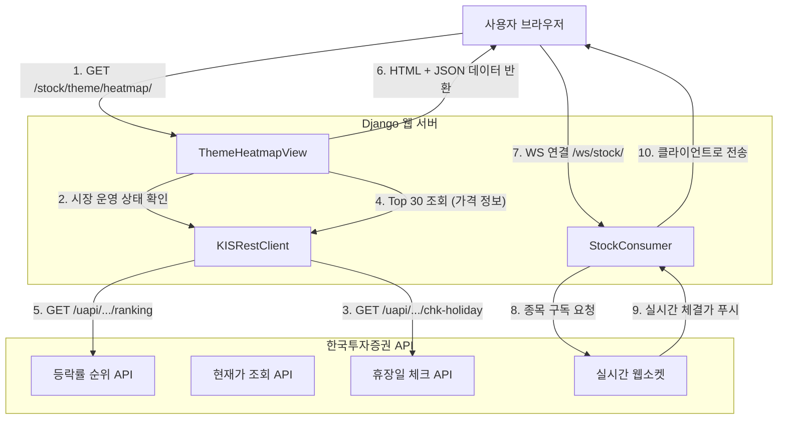

# API 아키텍처 문서

이 문서는 주식 테마 분석 기능의 API 구조, 연관 관계, 그리고 데이터 흐름을 설명합니다.

## 1. 시스템 개요

이 시스템은 사용자 경험과 데이터 최신성을 위해 **하이브리드 데이터 로딩 전략**을 사용합니다.
- **서버 사이드 렌더링 (SSR)**: Django View가 초기 HTML과 JSON 데이터를 생성하여 빠른 첫 화면 로딩을 보장합니다.
- **클라이언트 하이드레이션 (Client-Side Hydration)**: JavaScript가 전달받은 JSON 데이터를 이용해 시각화 요소(히트맵 등)를 렌더링합니다.
- **실시간 업데이트**: 시장이 열려있을 때 WebSocket(Django Channels)을 통해 실시간 가격 변동 정보를 푸시합니다.

## 2. API 데이터 흐름도

---

## 3. 내부 인터페이스 (Django Views)

프론트엔드에서 호출하는 주요 진입점입니다.

| URL 패턴 | View 클래스 | Method | 목적 |
| :--- | :--- | :--- | :--- |
| `/stock/theme/list/` | `DailyThemeListView` | GET | 일별 테마 리스트를 보여줍니다. |
| `/stock/theme/heatmap/` | `ThemeHeatmapView` | GET | 메인 히트맵 대시보드. Top 30 및 시장 상태를 조회합니다. |
| `/stock/ranking/` | `StockRankingView` | GET | Top 30 등락률 순위 표를 별도로 제공합니다. |
| `/stock/detail/<code >/` | `StockDetailView` | GET | 개별 종목의 상세 차트 및 호가 정보를 제공합니다. |

---

## 4. 외부 API 래퍼 (`KISRestClient`)

`stock_price/services/kis_rest_client.py`에 위치하며, 한국투자증권 Open API를 포장(Wrap)하고 있습니다.

| 메서드명 | KIS 엔드포인트 / TR ID | 목적 |
| :--- | :--- | :--- |
| `get_fluctuation_rank()` | `/ranking/fluctuation` (FHPST01700000) | 등락률 상위 30위 조회. **초기 가격 데이터의 주 원천**으로 사용됩니다. |
| `get_volume_rank()` | `/quotations/volume-rank` (FHPST01710000) | 거래량 상위 30위 조회. |
| `get_current_price(code)` | `/quotations/inquire-price` (FHKST01010100) | 단일 종목 현재가 조회. Ranking API 데이터가 없을 때(주말 등) **Fallback 용도**로 사용됩니다. |
| `get_market_operation_status()` | `/quotations/chk-holiday` (CTCA0903R) | 오늘 날짜의 휴장일 여부 및 장 운영 상태를 확인합니다. |

---

## 5. 웹소켓 API (실시간 통신)

`stock_price/consumers.py`에 정의되어 있습니다.

*   **엔드포인트**: `ws://<host>/ws/stock/`
*   **프로토콜**: JSON
*   **메시지 타입**:
    *   **Client -> Server**:
        *   `{"type": "subscribe", "code": "005930"}`: 특정 종목의 실시간 호가/체결가 구독 요청.
    *   **Server -> Client**:
        *   `{"type": "stock_update", "data": { ... }}`: 실시간 가격 업데이트 패킷 전송.

---

## 6. 핵심 로직 및 관계

1.  **지능형 Fallback 메커니즘 (데이터 보장 전략)**:
    *   `ThemeHeatmapView`는 먼저 **Ranking API (`get_fluctuation_rank`)**를 호출합니다. (가장 빠름)
    *   만약 Ranking API가 빈 값(0건)을 반환하면 (주말, 장전 등), 즉시 **병렬 처리(`ThreadPoolExecutor`)**를 통해 모든 테마 종목의 `get_current_price()`를 개별 조회합니다.
    *   이를 통해 주말이나 휴일에도 "0.00%"가 아닌, **직전 영업일 종가**를 항상 표시합니다.

2.  **시장 운영 상태에 따른 분기**:
    *   `stock_price/utils.py`는 `KISRestClient.get_market_operation_status()`를 통해 정확한 휴장일 정보를 확인합니다.
    *   이 정보(`is_market_open`)는 템플릿을 거쳐 프론트엔드(`theme_heatmap.js`)로 전달됩니다.
    *   **장 운영 중**: JS가 웹소켓에 연결하여 실시간 데이터를 받습니다.
    *   **장 종료/휴장**: JS가 웹소켓 연결을 시도하지 않아 리소스를 절약합니다.
