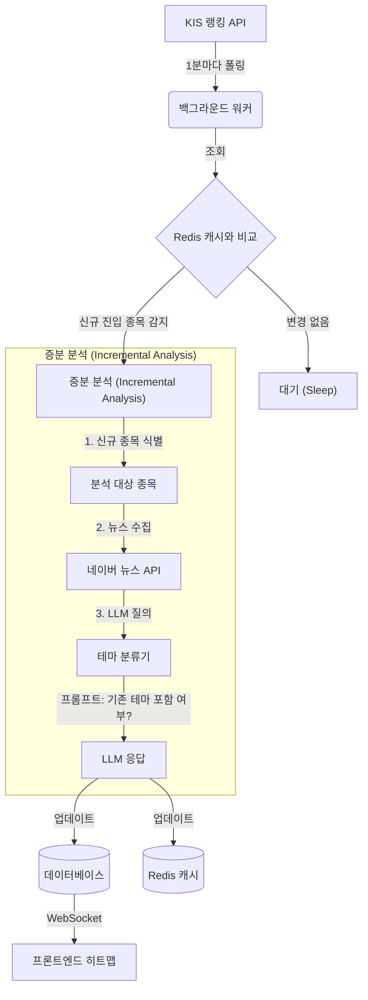

# 실시간 테마 동기화 설계 (증분 업데이트)

## 목표
빠르게 변하는 "실시간 급등주 Top 30" 랭킹과 테마 분석 시스템 간의 시차를 줄이고, 특히 **새롭게 진입하는 종목**을 즉시 감지하여 실시간으로 분류하는 것을 목표로 합니다.

## 아키텍처



## 구현 단계

### 1. Redis 캐싱
현재 분석된 Top 30 종목 코드를 집합(Set) 형태로 Redis에 저장하여 관리합니다.
- **Key**: `theme:current_top_30`
- **Value**: 종목 코드 집합 (예: `['005930', '000660', ...]`)

### 2. 순환 감시 루프
안정적인 백그라운드 프로세스(Celery 또는 Loop Command)가 다음 주기를 반복 수행합니다:
1.  **조회 (Fetch)**: `kis_rest_client.get_fluctuation_rank()` 호출.
2.  **비교**: 
    ```python
    current_set = set(new_rank_data_codes)   # 방금 가져온 랭킹
    cached_set = redis.get('theme:current_top_30') # 직전 랭킹
    new_entrants = current_set - cached_set  # 새로 들어온 종목들
    ```
3.  **필터링**: 순위권 밖으로 밀려난 종목(`cached_set - current_set`)은 무시하고, 시각화에 새로 추가될 종목에만 집중합니다.

### 3. 증분 LLM 업데이트 (`update_single_stock_theme`)
새로 진입한 각 종목에 대해 다음을 수행합니다:
1.  **컨텍스트 로드**: DB에서 *현재 활성화된 테마 명칭과 설명* 목록을 가져옵니다.
2.  **프롬프트 엔지니어링**:
    > "여기 새로운 급등주 [종목명]과 관련 뉴스 헤드라인들이 있어: [...].
    > 그리고 현재 활성화된 테마 목록은 이래: [테마 A, 테마 B, 테마 C].
    > **미션**: 이 종목이 위 테마 중 하나에 속하니? 
    > - 속한다면 -> 해당 테마명을 반환해.
    > - 아니라면 -> '기타' 혹은 새로운 마이크로 테마명을 제안해줘."
3.  **DB 조치**: 
    - 기존 테마 편입 시: `ThemeStock.create(theme=existing_theme, stock=new_stock)`
    - 신규 테마 생성 시: `Theme.create(...)` + `ThemeStock.create(...)`

### 4. WebSocket 알림
DB가 업데이트되면 연결된 모든 클라이언트에게 즉시 알림을 보냅니다:
- **Type**: `theme_update`
- **Payload**: 전체 갱신된 히트맵 데이터 또는 추가된 블록 정보.

## 고려사항
- **비용**: LLM 호출은 비용이 듭니다. 캐시 비교를 통해 진짜로 "새로운" 종목일 때만 호출하도록 제한해야 합니다.
- **안정성**: 종목이 30위권 경계에서 넣었다 뺐다(Flickering) 할 수 있습니다. 이를 방지하기 위해 "Debounce" 기술이나 "최소 유지 시간(예: 3분 이상 랭크 유지 시 분석)" 조건을 걸 수 있습니다.
- **비상 대책**: LLM 응답이 지연되거나 실패할 경우, 해당 종목을 임시로 "미분류" 테마로 시각화합니다.
